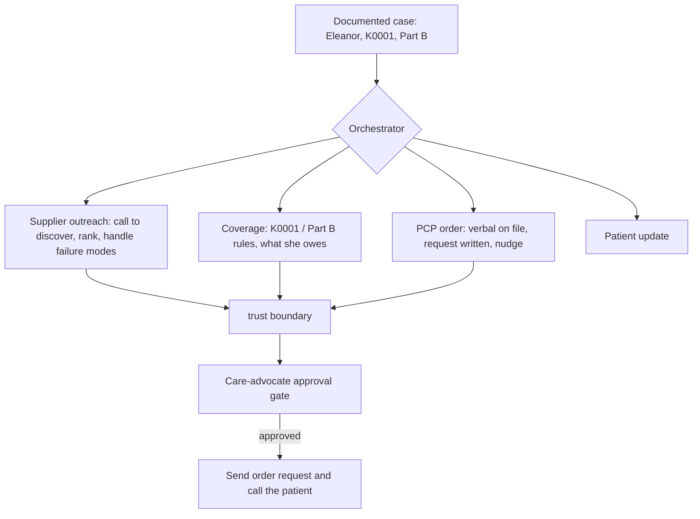

# DME Back-End Coordination

A coordination engine for Medicare durable medical equipment (DME). Intake is already
done. Starting from a documented case, it works the back-end coordination across four
surfaces (supplier outreach, PCP order, coverage, patient update) and puts a care
advocate in charge of anything that commits.

**The one idea everything is built around:** the system owns *coordination*, not
*clinical or coverage judgment*. Calling to discover runs on its own. Anything that
commits on the patient's behalf is gated behind a care advocate and is reversible. The
system says "here's what's needed and what you'll owe," never "you're covered."

## Where to find things

| Document | What it is |
|---|---|
| [WRITEUP.md](WRITEUP.md) | The writeup: sequencing, technology and architecture, cut list, what's next. Read this first. |
| This README | The fuller walkthrough and how to run everything. |
| [DESIGN.md](DESIGN.md) | Decision log (every choice and the alternatives rejected) and a defense kit. |
| [cekura/README.md](cekura/README.md) | The voice-eval layer for the outbound agents. |

Run it with no keys and no phone in about 30 seconds:

```bash
pip install -r requirements.txt
python -m sim.run_demo
```

This works the Eleanor case end to end. The mocked supplier call outcomes include every
failure mode the brief names (no answer, voicemail, said-yes-then-silent, not taking
patients, out of stock, does not accept assignment), so the coordination judgment is
visible, not assumed.

## The case

Eleanor Martinez, 72, Original Medicare Part B, no supplemental. Standard manual
wheelchair (K0001). PCP visit done three days ago, verbal order in the chart, written
order not yet submitted. No suppliers contacted. Sparse supplier directory in
[data/sample-supplier-directory.csv](data/sample-supplier-directory.csv) (name, phone,
address only, a stand-in for the recruiter's CSV; drop theirs in to swap).

## The four surfaces



Calling suppliers to discover availability and reading the coverage rules run on their
own. Sending the order request to the PCP and calling the patient are gated.

## What's real, mocked, and deterministic

| Layer | Status |
|---|---|
| Supplier outreach (rank discovered outcomes) | Real, Claude (`claude-opus-4-8`), deterministic fallback |
| Coverage check (K0001, Part B) | Deterministic (`app/coverage.py`), never a verdict |
| Orchestration and the care-advocate gate | Real (`app/orchestrator.py`) |
| Outbound voice (supplier and patient calls) | Real via Vapi, config in `vapi/`, mock by default |
| Supplier call outcomes, PCP office, insurance | Mocked (`data/`) |

The model split is deliberate: a fast model runs the live calls where latency is the
experience, and a stronger model runs the async synthesis where quality matters.

## Run the backend and the care-advocate console

```bash
uvicorn app.main:app --port 8000 --reload
# open http://127.0.0.1:8000/  then click "Build Eleanor's case"
```

The console shows the next action, the blockers, the coverage check, the supplier board
(ready / call-back / can't-serve), and the four surfaces split by the trust boundary.
Approve to fire the gated surfaces and see the patient update.

Endpoints: `POST /case/build`, `GET /plans`, `GET /plans/{id}`,
`POST /plans/{id}/approve`, `POST /plans/{id}/reject`, `POST /vapi/webhook`.

## Evals and monitoring (three layers)

The trust boundary is guarded at three levels.

| Layer | What it checks | Where |
|---|---|---|
| Backend policy | discovery policy, gating, coverage never fabricated, blockers surfaced | `evals/run_evals.py` |
| Live conversation | the outbound agent records outcomes and never discusses coverage | `evals/conversation_evals.py` |
| Deployed voice agent | the real Vapi agent on telephony, graded by Cekura supplier personas | [`cekura/`](cekura/README.md) |

```bash
python -m evals.run_evals            # backend policy
python -m evals.conversation_evals   # add ANTHROPIC_API_KEY for the live layer
```

## Tests and linting

```bash
pip install -e ".[dev]"
make gate    # ruff, format check, pytest, evals, and a demo run
```

`tests/` holds unit tests (coverage rules, supplier outreach, the orchestrator and gate)
and functional tests (build a case, review it, approve or reject). Style is ruff,
configured in [pyproject.toml](pyproject.toml), and the whole gate runs in CI on every
push.

## Wiring up real voice (Vapi)

Create an assistant from `vapi/assistant.json` with the outbound supplier prompt in
`vapi/system_prompt.md` (and the patient prompt in `vapi/patient_update_prompt.md`),
point `server.url` at your tunnel plus `/vapi/webhook`, and set `VAPI_API_KEY` and
`VAPI_PHONE_NUMBER_ID`. Without them the calls run in mock mode. `vapi/provision.py` does
this over the API in one step.
