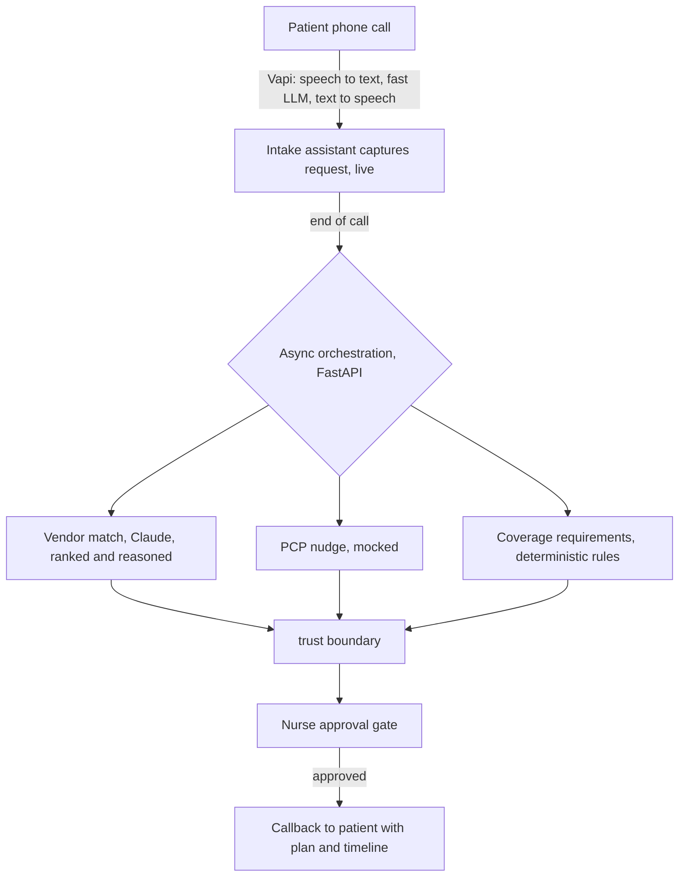

# DME Voice Agent

A voice agent that takes a Medicare patient's inbound call for durable medical
equipment (DME), captures what they need, researches in-network vendors in the
background, and calls them back. A nurse approves anything that carries liability
before it happens.

**The one idea everything is built around:** the agent owns *coordination*, not
*clinical or coverage judgment*. Reads are automated. Liability-bearing writes are
gated behind a nurse and are reversible. The agent tells a patient "here's what's
needed," and never "you're covered."

This is a take-home, so it's a learning artifact rather than a product. The goal was
to probe the problem deeply enough to commit to real design choices, not to build a
small version of the whole system.

## Where to find things

| Document | What it is |
|---|---|
| [WRITEUP.md](WRITEUP.md) | The 1-page deliverable: slice, implementation, tradeoffs. Read this first. |
| This README | The fuller walkthrough, plus how to run everything. |
| [DESIGN.md](DESIGN.md) | Decision log (every choice and the alternatives I rejected) and a defense kit. |
| [docs/sample_call.md](docs/sample_call.md) | Transcript and recording of a real call I placed to the agent. |
| [docs/cekura_results.md](docs/cekura_results.md) | Graded results from the voice-eval simulations. |
| [cekura/README.md](cekura/README.md) | The voice-eval layer (Cekura) in detail. |
| [docs/demo_script.md](docs/demo_script.md) | A 3-minute screen-recording script. |

Run it with no keys and no phone in about 30 seconds:

```bash
pip install -r requirements.txt
python -m sim.run_demo
```

## The slice

I took the front door and the orchestration handoff. The agent answers the inbound
call, captures a structured request from natural speech, and decides what can proceed
on its own versus what needs a human. Then it runs one async leg for real, the
in-network vendor research and matching, which is the exact task nurses say is most
painful. Finally it closes the loop with a callback.

I picked this slice for two reasons. First, it's where voice AI clearly helps: a warm,
patient intake conversation and clean extraction from messy speech. Second, it's where
the trust line is sharpest. You must never tell a Medicare patient they're covered, so
the front door is where getting the boundary right matters most.

What I deliberately did not build: the live PCP/EHR order write, the insurance coding
loop, and a real supplier directory. Those are either plumbing or high-liability work
with low signal for a short exercise. The interesting decisions (what to capture, when
to nudge the PCP, who gets to decide coverage) all live inside the slice I chose.

## The implementation



Where the work goes, and why:

- **AI does the judgment work.** The live conversation and the vendor research and
  ranking. Both are judgment under messiness, which is what models are good at and
  rule engines are not. The vendor matcher explains its reasoning so a nurse can check it.
- **Deterministic code does the rules.** The Medicare coverage-requirements checklist
  and the gating and escalation logic. The agent surfaces what's needed and never
  improvises eligibility. Reliability and auditability matter more than flexibility here.
- **A human owns the liability.** A nurse approves every write that touches the patient
  or the PCP.

| Layer | Status |
|---|---|
| Inbound voice call | Real (Vapi, config in `vapi/`) |
| Structured extraction during the call | Real (Vapi tool calls into `app/main.py`) |
| In-network vendor matching and ranking | Real, Claude (`claude-opus-4-8`), with a deterministic fallback |
| Coverage requirements checklist | Deterministic (`app/coverage.py`), never a coverage decision |
| Nurse approval gate | Real (`app/store.py`, console endpoints) |
| Patient callback | Real via Vapi outbound, mock by default (`app/callback.py`) |
| Supplier directory, PCP office/EHR, insurance | Mocked (`mock_suppliers.json`) |

**The model split is intentional.** A fast model (`claude-haiku-4-5`) runs the live
conversation, because in a phone call latency is the user experience. A stronger model
(`claude-opus-4-8`) runs the async vendor research, where quality matters and latency
does not.

**On the voice platform.** If I had more time I'd reach for LiveKit. It gives you far
more control over the audio pipeline, turn-taking, interruptions, and tool
orchestration, which is what a real production healthcare agent needs. I chose Vapi for
this exercise because it gets a real, good-sounding phone call running quickly, which is
what a short demo calls for. The backend is decoupled from the voice layer, so the
captured-request and webhook contracts stay the same. Swapping Vapi for LiveKit later
is a contained change, not a rewrite.

## The evals (the part I'd most want to talk about)

This was the most interesting part of the build, and on a system with this many moving
parts (telephony, speech recognition, an LLM, tools, a backend) it's the thing that
keeps it honest. The trust boundary is guarded at three levels.

| Layer | What it checks | Cost | Where |
|---|---|---|---|
| Backend policy | trust boundary, escalation, gating, coverage never fabricated | instant, no key | `evals/run_evals.py` |
| Live conversation | extraction plus never-claims-coverage under adversarial turns | Anthropic API | `evals/conversation_evals.py` |
| Deployed voice agent | the real Vapi agent on telephony: speech, latency, interruptions, drift | persona calls (Cekura) | [`cekura/`](cekura/README.md) |

```bash
python -m evals.run_evals            # backend policy
python -m evals.conversation_evals   # add ANTHROPIC_API_KEY for the live layer
```

The first two layers run offline and assert the policy rather than a model's exact
phrasing, so they pass whether the vendor matcher used Claude or the fallback. The
mocked supplier directory has two planted "trap" suppliers (one out-of-network but
responsive, one in-network but not accepting assignment) so a correct ranking proves
judgment instead of a lookup.

The third layer is the interesting one. [Cekura](cekura/README.md) drives LLM-persona
callers into the live phone number and grades the audio against the same trust-boundary
rubrics, then monitors production traffic with those same metrics. In a real run
([docs/cekura_results.md](docs/cekura_results.md)) the safety-critical
"never claims coverage" metric held up even against a caller who pushed hard for a
yes-or-no answer. The suite also caught two real bugs on the deployed agent: a call that
would not terminate (about ten minutes, with the agent looping "goodbye") and a habit of
stacking several questions into one turn. I fixed the first decisively (the call now
ends itself in about two minutes) and substantially improved the second. Found, fixed,
re-verified. That loop is exactly why this layer exists.

## The tradeoffs

**Where more data would change my decisions.** Real vendor responsiveness and
fulfillment data would turn the hand-tuned ranking into a learned one. Logs of
extraction confidence versus nurse corrections would let me set the auto-versus-human
threshold (currently 0.6) from evidence instead of a guess. Callback-outcome rates would
tell me whether better expectation-setting actually reduces how much a patient has to
chase everyone, which is the real business metric.

**What would worry me about shipping this to real patients.** Tone that implies coverage
certainty, since tone in live speech is harder to guarantee than text (this is what the
Cekura coverage metric watches). Silent async failure, where a plan stalls and no
callback ever fires, which is the scariest path because it's invisible and needs an SLA
timer with alerting. Accessibility for non-English and hard-of-hearing callers, which I
did not handle. And PHI on the call, which in production needs BAA-covered vendors,
encryption, and a retention policy.

## Running the backend and the nurse console

```bash
uvicorn app.main:app --port 8000 --reload
# open http://127.0.0.1:8000/ for the nurse console
# expose for Vapi with: ngrok http 8000
```

The console is the trust boundary made clickable. Simulate an inbound call with one
button, see the ranked vendors with the trap suppliers excluded, then approve a plan and
watch the gated legs fire and the callback script appear.

Endpoints: `GET /` (console), `POST /vapi/webhook` (Vapi tool calls and end-of-call),
`POST /demo/seed?scenario=happy|no_vendor|low_conf`, `GET /plans`, `GET /plans/{id}`,
`POST /plans/{id}/approve`, `POST /plans/{id}/reject`.

## Tests and linting

```bash
pip install -e ".[dev]"     # pytest and ruff
make gate                   # lint, format check, tests, evals, and a demo run
```

`tests/` holds unit tests (coverage rules, vendor matching, the approval gate) and
functional tests (the Vapi webhook to plan to approve flow). `evals/` holds the policy
and conversation evals. Style is enforced by ruff and the whole gate runs in CI on every
push. Config lives in [pyproject.toml](pyproject.toml).

## Wiring up real voice (Vapi)

Create an assistant from `vapi/assistant.json` with the system prompt in
`vapi/system_prompt.md`, point its `server.url` at your tunnel plus `/vapi/webhook`, and
set `VAPI_API_KEY` and `VAPI_PHONE_NUMBER_ID` for the callback leg. Without those the
callback runs in mock mode and logs the script. `vapi/provision.py` does this over the
API in one step.
