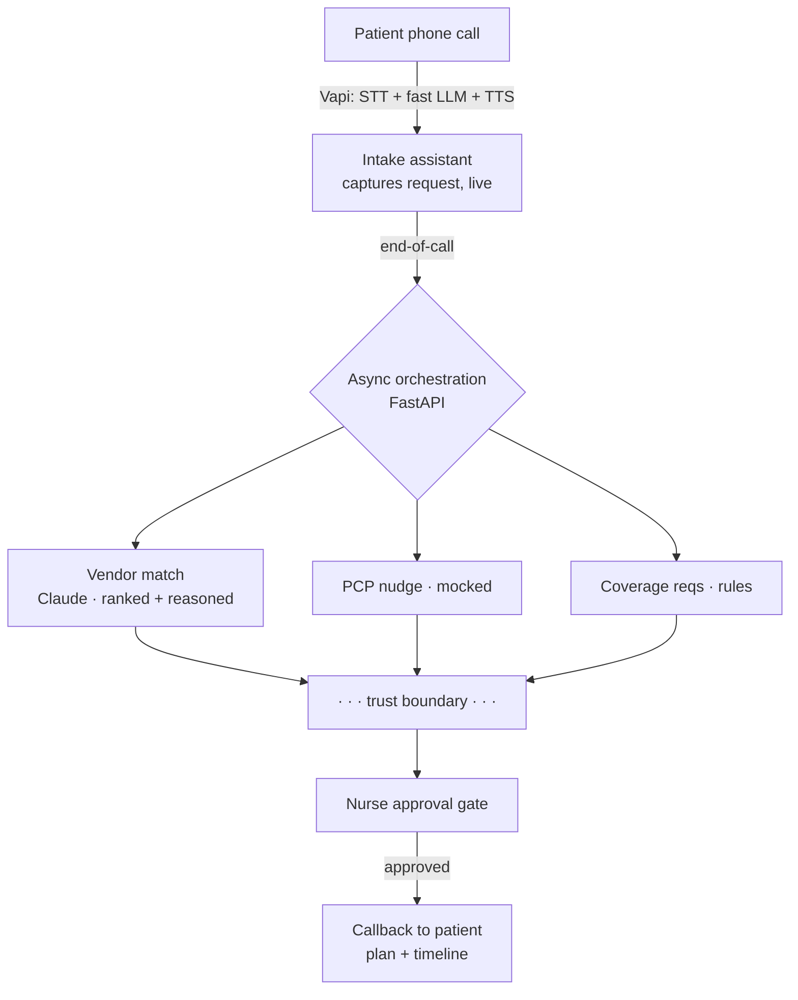

# DME Voice Agent — working slice

A voice agent that takes a Medicare patient's inbound call for durable medical
equipment, captures the request, does the in-network vendor research async, and
calls back — with a nurse approval gate on everything that touches liability.

**The thesis:** the agent owns *coordination*, not *clinical or coverage
judgment*. Reads are automated; liability-bearing writes are gated and
reversible. The agent says "here's what's needed," never "you're covered."

### Start here (for reviewers)
1. **[WRITEUP.md](WRITEUP.md)** — the 1-page deliverable (slice / implementation / tradeoffs).
2. **Run it in 30s, no keys, no phone:** `pip install -r requirements.txt && python -m sim.run_demo`
   then `python -m evals.run_evals`.
3. **[docs/sample_call.md](docs/sample_call.md)** — transcript of a real call; **[docs/cekura_results.md](docs/cekura_results.md)** — graded results from Cekura persona-call simulations.
4. Deeper: [DESIGN.md](DESIGN.md) (decisions + defense kit), [cekura/README.md](cekura/README.md) (voice-eval layer), [docs/demo_script.md](docs/demo_script.md).



## What's real / mocked / deterministic

| Layer | Status |
|---|---|
| Inbound voice call | REAL (Vapi — config in `vapi/`) |
| Structured extraction during the call | REAL (Vapi tool calls → `app/main.py`) |
| In-network vendor matching + ranking | REAL — Claude (`claude-opus-4-8`), with a deterministic fallback |
| Coverage *requirements* checklist | DETERMINISTIC (`app/coverage.py`) — never a coverage decision |
| Nurse approval gate | REAL (`app/store.py`, console endpoints) |
| Patient callback | REAL via Vapi outbound, MOCK by default (`app/callback.py`) |
| Supplier directory, PCP office/EHR, insurance | MOCKED (`mock_suppliers.json`) |

## Run the demo (no telephony, no API key needed)

```bash
pip install -r requirements.txt
python -m sim.run_demo
```

This drives the full thread on the scenario from the brief (wheelchair, recent
PCP visit, no order, PCP office closed) plus two failure paths (no in-network
supplier; low-confidence extraction → human). The vendor directory has two
"trap" suppliers so a correct ranking proves judgment, not a lookup.

**To run the AI vendor-matching with Claude** (otherwise the deterministic
fallback runs):

```bash
ANTHROPIC_API_KEY=sk-... python -m sim.run_demo
```

## Run the backend + nurse console

```bash
uvicorn app.main:app --port 8000 --reload
# then open http://127.0.0.1:8000/   (visual nurse console)
# expose for Vapi:  ngrok http 8000   (or any tunnel)
```

The console (`/`) is the trust boundary made clickable: simulate an inbound call
with one button, see the ranked vendors with the trap suppliers excluded, then
Approve to watch the gated legs fire and the callback script appear.

Endpoints:
- `GET  /` — nurse console (HTML)
- `POST /vapi/webhook` — Vapi tool-calls + end-of-call-report
- `POST /demo/seed?scenario=happy|no_vendor|low_conf` — seed a plan (drives the console)
- `GET  /plans` · `GET /plans/{id}` — plan data
- `POST /plans/{id}/approve` — fires the gated legs + patient callback
- `POST /plans/{id}/reject?reason=...`

## Evals & monitoring — three layers

The same trust boundary is guarded at three levels, from fast/cheap to full-fidelity:

| Layer | What it checks | Cost | Where |
|---|---|---|---|
| **Backend policy** | trust boundary, escalation, gating, coverage never fabricated | instant, no key | `evals/run_evals.py` (6/6) |
| **Live conversation** | extraction + never-claims-coverage under adversarial turns | Anthropic API | `evals/conversation_evals.py` |
| **Deployed voice agent** | the real Vapi agent on telephony: ASR/TTS, latency, interruptions, drift | persona calls (Cekura) | [`cekura/`](cekura/README.md) |

```bash
python -m evals.run_evals            # backend policy
python -m evals.conversation_evals   # +ANTHROPIC_API_KEY for the live layer
```

**Cekura** ([cekura/README.md](cekura/README.md)) drives LLM-persona callers into the
live number and grades the audio against the *same* trust-boundary rubrics — then
monitors production traffic with them. A real run ([docs/cekura_results.md](docs/cekura_results.md)):
the safety-critical `never_claims_coverage` metric **held under an adversarial
coverage-pressure caller**, and the suite **caught two real bugs** on the deployed
agent — the call never terminating (~10-min calls; fixed decisively → ~2 min, the agent
self-ends) and question-stacking (substantially improved). Found → fixed → re-verified.
Same rubric runs in production monitoring.

You can also trigger Cekura runs from Claude Code via its MCP server (wired in
[`.mcp.json`](.mcp.json)).

Quick local exercise of the webhook → approve flow:

```bash
python -c "from fastapi.testclient import TestClient; from app.main import app; c=TestClient(app); \
print(c.post('/vapi/webhook', json={'message':{'type':'tool-calls','call':{'id':'c1'},'toolCallList':[{'id':'t1','function':{'name':'capture_request','arguments':{'equipment':'standard_wheelchair','plan_id':'HUM-MA-PPO','confidence':0.95}}}]}}).json())"
```

## Tests & linting

```bash
pip install -e ".[dev]"                              # pytest + ruff
python -m pytest                                     # unit + functional tests
python -m ruff check . && python -m ruff format --check .
```

`tests/` holds **unit** tests (coverage rules, vendor matching, the approval gate) and
**functional** tests (the Vapi webhook → plan → approve flow via `TestClient`); `evals/`
holds the **policy + voice** evals. Style is enforced by ruff, configured in
[`pyproject.toml`](pyproject.toml).

## Wire up real voice (Vapi)

1. Create an assistant from `vapi/assistant.json` (paste `vapi/system_prompt.md`
   into the system message).
2. Set the assistant `server.url` to `https://<your-tunnel>/vapi/webhook`.
3. For the callback leg, set `VAPI_API_KEY` and `VAPI_PHONE_NUMBER_ID`; without
   them the callback runs in mock mode (logs the script).

Model split on purpose: a **fast** model (`claude-haiku-4-5`) runs the live
conversation where latency is UX; the **strong** model (`claude-opus-4-8`) runs
the async vendor research where quality matters and latency doesn't.
